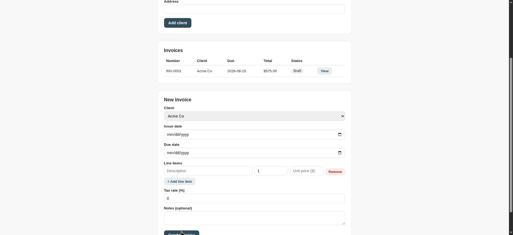

# Invoicing Tool — showcase project

A simple invoicing tool for a freelancer/small business: manage clients,
create invoices with line items and tax, track status (draft/sent/paid),
and export a clean invoice as a PDF via the browser's print function.

Built as a freelance portfolio piece, demonstrating money-math correctness
(cents-based arithmetic, tested), auth-protected APIs, and a practical,
dependency-free approach to "PDF export."

**Live demo:** https://invoicing-tool-baum.onrender.com

## Architecture decisions

- **Money is stored and calculated in cents (`int64`), never floats.**
  Floating-point arithmetic on money values is a classic source of subtle
  bugs (e.g. rounding errors accumulating across many invoices). All
  totals/subtotals/tax are covered by tests in `internal/invoicing/calc_test.go`.
- **The entire API requires authentication.** Unlike the booking system,
  this tool has no public-facing side — every user of this API is the
  freelancer managing their own business, so there's no split between
  public and admin routes.
- **PDF export uses the browser's native "Print > Save as PDF"**, not a
  server-side PDF library — there's no internet access in this dev
  environment to fetch one, and print-to-PDF is a legitimate, widely-used
  approach for exactly this kind of tool. `style.css` has a `@media print`
  section that hides everything except the invoice itself when printing.
- **Storage is built behind a `Store` interface**
  (`internal/invoicing/store.go`), with two implementations: `MemoryStore`
  for quick local runs and tests, and `SQLiteStore`
  (`internal/invoicing/sqlite_store.go`) for real persistence. Both
  satisfy the exact same interface, so the API layer is completely
  unaware which one is active.
- **Invoices and line items are modeled as two related SQL tables**
  (`invoices` and `invoice_line_items`, joined on `invoice_id`), not
  flattened into a JSON blob column — an invoice genuinely has a
  one-to-many relationship with its line items, so the schema reflects
  that.

## Running it

```
go test ./... -v
go run ./cmd/server
```

By default this uses in-memory storage (nothing survives a restart). To
persist data to a real SQLite database instead:

```
DB_PATH=data.db go run ./cmd/server
```

Then open http://localhost:8081/ (default credentials: `admin` /
`changeme`, override via `ADMIN_USER` / `ADMIN_PASSWORD` env vars).

Workflow: add a client, create an invoice for them with one or more line
items, then open the invoice to view/print it or mark it sent/paid.

## Live demo

This app has no public side — every route needs login. To try it:

- URL: https://invoicing-tool-baum.onrender.com
- Username: `demo`
- Password: `demo1234`

(Deliberately public, low-stakes credentials — this is a portfolio demo
with no real client data behind it.)

## Deploying (Render)

1. Push this repo to GitHub.
2. On Render: New → Web Service → connect the repo.
3. Build command: `go build -o app ./cmd/server`
4. Start command: `./app`
5. Environment variables: `DB_PATH=data.db`, `ADMIN_USER=demo`,
   `ADMIN_PASSWORD=demo1234` (or your own — just keep the README's Live
   demo section in sync). Render sets `PORT` automatically — the app
   already reads it.

Note: Render's free tier disk is ephemeral on redeploy, so `data.db`
resets then — fine for a portfolio demo, not for real production data
without a persistent disk add-on.

## Screenshots


.png>)
